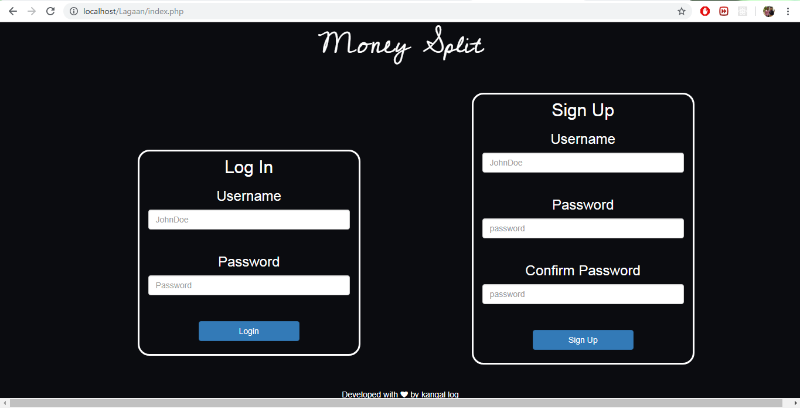
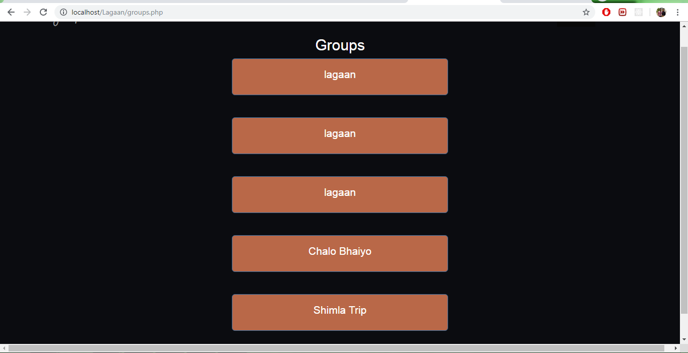
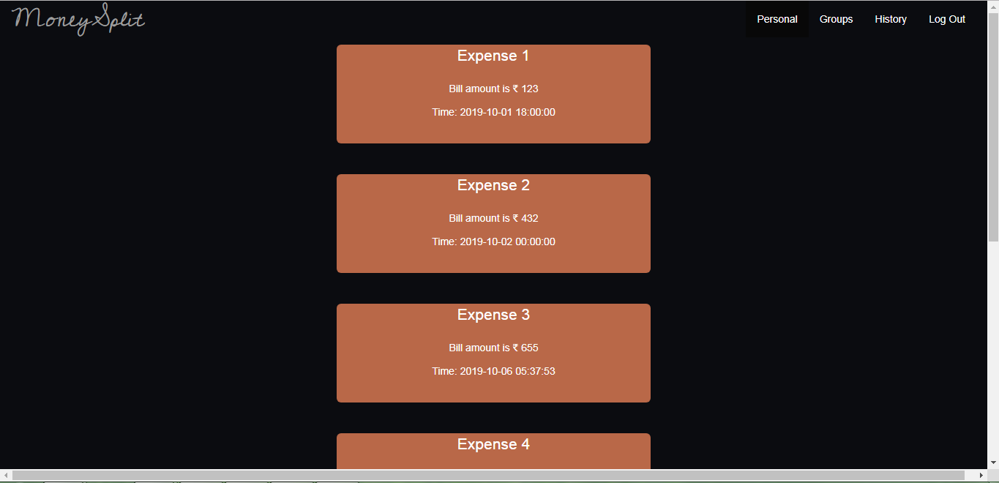

<h1 align="middle">Expense Manager</h1>

Expense manager for an individual as well as for group expenses. Major feature was using OCR to get the bill amount and restaurant name. Worked on this during KJSCE HACK 2019.

------------------------------------------

    
    
    
    
    

------------------------------------------

### Tech Stack
- HTML
- CSS
- JavaScript
- PHP
- MySQL

------------------------------------------

### Contributors
- [@Raj Vora](https://github.com/raj-vora)
- [@Jaynam Sanghvi](https://github.com/JaynamSanghavi)
- [@Aayush Parekh](https://github.com/aparekh7)
- [@Darshan Gandhi](https://github.com/darshan-gandhi)
